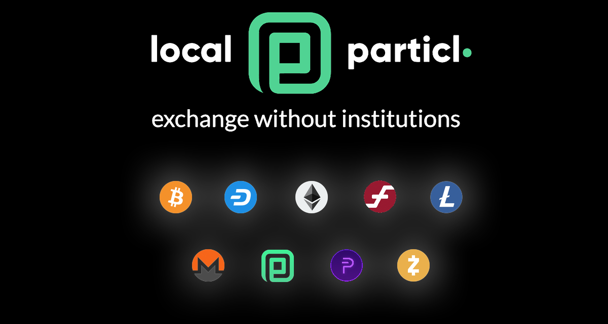

## About

> [LocalParticl.com](https://www.localparticl.com) is a global peer-to-peer exchange helping facilitate in-person trades for cash, removing the need for bank accounts or any 3rd party financial institution in order to start participating in the Particl economy.

Available in 15+ languages and supporting 100+ currencies.

### Additional coins supported

- PIVX
- Monero
- Dash
- ZCash
- Firo
- Ethereum
- Litecoin
- Bitcoin

## How it works

Post an advertisement in your city or respond to someone else's advertisement in your locality. Agree on a time and place to meet. Communication within the website is secured with in-browser PGP encryption.

The person who will be sending the cryptocurrency will have to deposit enough into their LocalParticl.com wallet to cover the transaction. Once enough has been deposited, the funds are locked into escrow. Either party can cancel the trade at any time unlocking these funds.

The person exchanging their cash for cryptocurrency will be provided a code on the trade page to write down or remember after enough cryptocurrency has been deposited. 

Once the cryptocurrency is sent, the release code is displayed on the cryptocurrency sender's device and should match the code provided. Cash can now safely be handed over completing the exchange.

For more information head over to our [Help page](https://www.localparticl.com/page=docs&name=help).
