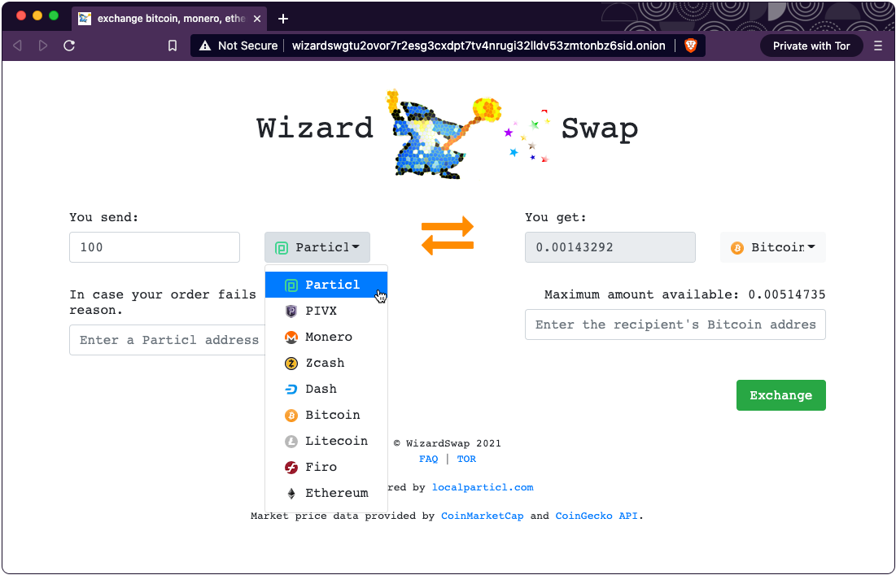

> [WizardSwap.io](https://www.wizardswap.io) is the simplest way to exchange Particl with other cryptocurrencies.

* No sign-ups required
* [Tor browser support](http://wizardswgtu2ovor7r2esg3cxdpt7tv4nrugi32lldv53zmtonbz6sid.onion/)
* Fixed pricing
* Live customer service

Unlike many other swapping platforms out there, [WizardSwap](https://www.wizardswap.io) does not interact with any exchange order books so orders have no influence on any exchange prices. Instead it draws liquidity directly from [localparticl.com](https://www.localparticl.com) users who have deposited funds and opted to enable swaps. Pricing is based on a global average plus the margins liquidity providers have set.
